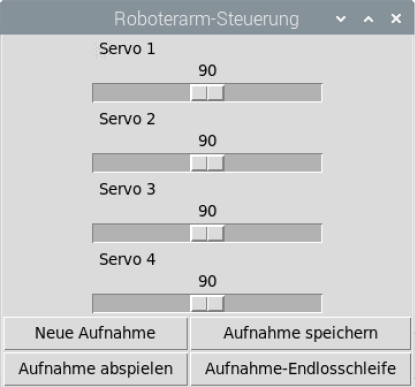

# Roboterarm

Waveshare Robot Arm for Pi

## Benutzeroberfläche

Die Benutzeroberfläche kann über das Terminal mit dem Befehl `./robot_arm_control.py` aufgerufen werden.

Neben dem Anpassen der Servopositionen gibt es die Möglichkeit, Bewegungsabläufe aufzunehmen, abzuspeichern und beliebig oft wieder abzuspielen.

## Verwendete Bibliotheken

* [PCA9685.py](https://www.waveshare.com/wiki/Robot_Arm_for_Pi) (Download unter `Demo code`)
